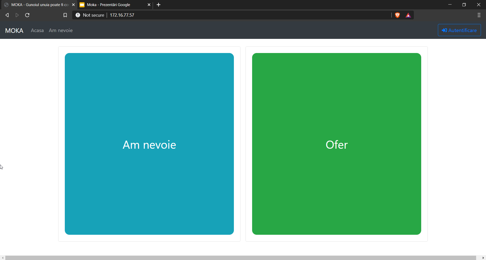
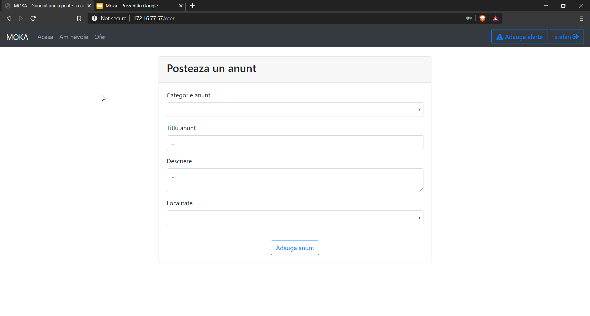
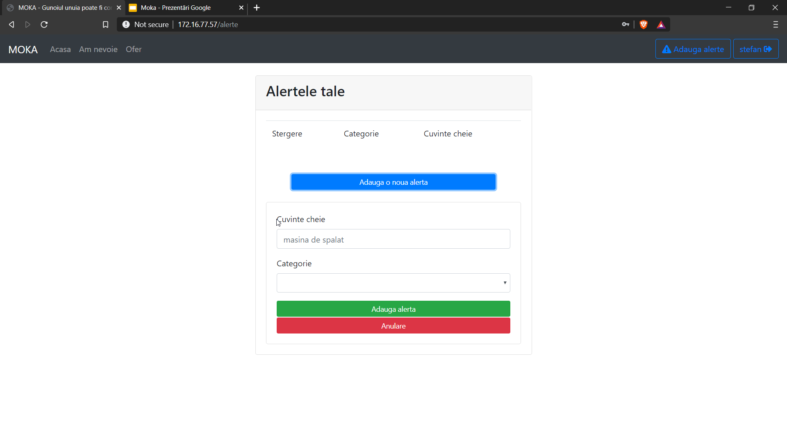
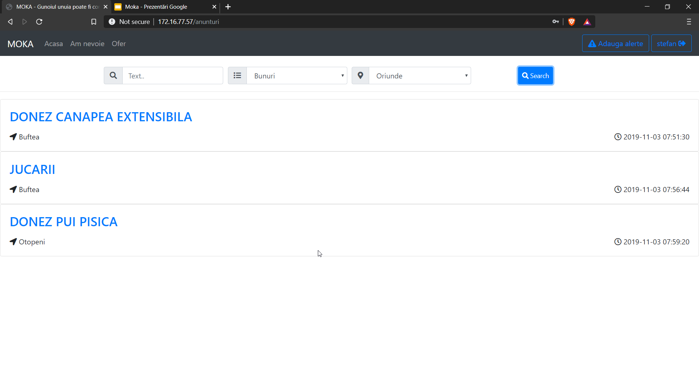

# Smarthack

Smarthack is a 24 hours hackathon where teams of 3-4 students work at developing a software-based product on a defined theme. The best team wins.    
Smarthack was on 02-03 november 2019. 

This year theme is: How can you help the society you live in, using technology?

## The Codeleones

Our team:
* [Alexandru Tesileanu](https://github.com/Teshyx)
* [Stefan Cristea](https://github.com/stefancristea)
* [Radu Dilirici](https://github.com/radudilirici)
* [Mihai Stoian](https://github.com/mihainsto)

***

# Moka

A web app that lets people donate things that are no longer useful for them. Such as food, items or services.  
A lightweight(no ML) version of the app hosted on heroku: http://mokacodeleones.herokuapp.com/ (It takes a while to load because heroku wakes the web server on request)  

 Design:
 

  
  
  
  

 
    
 
 
 Technologies used:  
 Vue.js - frontend  
 Flask - backend  
 MySQL - database  
 Pretrained word2vec model - Machine Learning  
 
 
